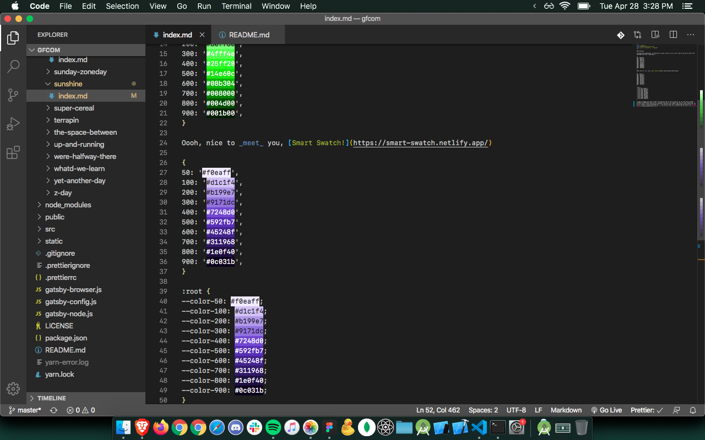

Good morning!

The puppy dozes peacefully, at some point I've got to get a run in, first I want to go over my notes from yesterday and start a page going ...

{
50: '#e0ffe0',
100: '#b1ffb1',
200: '#80ff80',
300: '#4fff4e',
400: '#25ff20',
500: '#14e60c',
600: '#08b304',
700: '#008000',
800: '#004d00',
900: '#001b00',
}

Oooh, nice to _meet_ you, [Smart Swatch!](https://smart-swatch.netlify.app/)

{
50: '#f0eaff',
100: '#d1c1f4',
200: '#b199e7',
300: '#9171dc',
400: '#7248d0',
500: '#592fb7',
600: '#45248f',
700: '#311968',
800: '#1e0f40',
900: '#0c031b',
}

:root {
--color-50: #f0eaff;
--color-100: #d1c1f4;
--color-200: #b199e7;
--color-300: #9171dc;
--color-400: #7248d0;
--color-500: #592fb7;
--color-600: #45248f;
--color-700: #311968;
--color-800: #1e0f40;
--color-900: #0c031b;
}

I wonder if people ever ship js that's writing over the css just to back it up, lol. Now that I've been reading more BEM-style code I think I could go with that. It is kinda wordy, but not like, reaaalllyyy. // Oo, yay, spent a minute cleaning up my dotfiles, that felt good. Hadn't really been in there since zsh. And oh no, it doesn't translate through the ... I was going to say, but I upgraded node and haven't run `gatsby develop` on this project since ... anyway ...

Okay, I need to close tabs now and make sure I get the important things done. Save what I was looking into, though, good stuff here:

At some point I should go through image url("./yourSrc.png") and the backhand shorthand that can go after the source. [MDN: background](https://developer.mozilla.org/en-US/docs/Web/CSS/background)

[Hero-generator.netlify.app](https://hero-generator.netlify.app/) is a cool dev tool from Sarah Drasner [@sarah_edo on Twitter](https://twitter.com/sarah_edo) and I wonder if I can make something like that for like text... I always have to futz with it, if I'm going for something specific ... anyway this is where the backhand shorthand questions came from.

[Date-fns,](https://date-fns.org/) I was going to replace Moment for the kb ...

[Create-react-app Chakra UI template!](https://github.com/yoannfleurydev/cra-template-chakra-ui) If you've seen Chakra UI (I have!) and like create-react-app! (I do!) you'd be as excited by this as I am right now! I should start a whole folder for starters, at this point! Folder time is coming, lol.

[This is the chat with Socket.IO I was going to go through to add chat to runs,](https://medium.com/today-i-learned-chai/building-a-simple-chat-application-with-node-js-and-socket-io-a7d7b38fd028) I think this might be like almost next. I think making the landing page logic and having that look decent is next? Or at least the logic, like if the user has runs coming up, otherwise same space for going to new runs, and if their buds have any upcoming runs, buds with runs, otherwise same space for getting new buds.

Then there was Gulp ... also, I ended up with an app that's like a shell on my phone. It's got Python, C, and C++, and it's basically a shell but not technically. [aShell. Wild.](https://holzschu.github.io/a-Shell_iOS/)

Okay, so that's the browser tabs, the real next step should be fixing what's going on with this very website's build tool, because I updated Node and now `gatsby develop` doesn't work.

But _really_ the next thing to fix up should be my resume and CV, and _really_ responding to that email. So we'll start there.

Okay, email responded to ... and I think resume/CV are going to be what I have to get through before coding tomorrow when I have more energy, I trained and trained Dawa today and I'm like totally pooped. I know they were supposed to be afternoon-stuff yesterday, you wouldn't believe how yesterday ended up going in the evening, though, I'll tell you about it over a beer or three sometime, lol.

Best wishes!
~g
