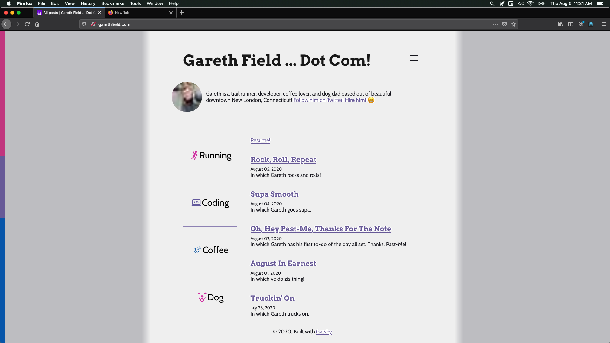
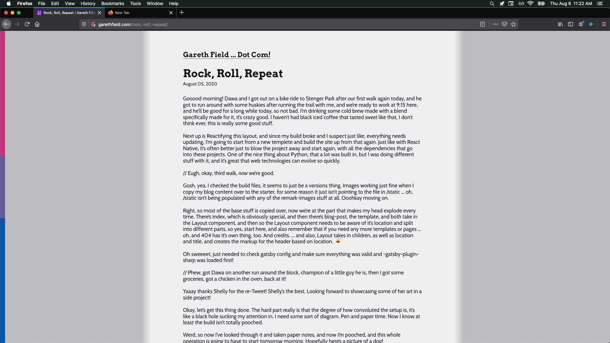
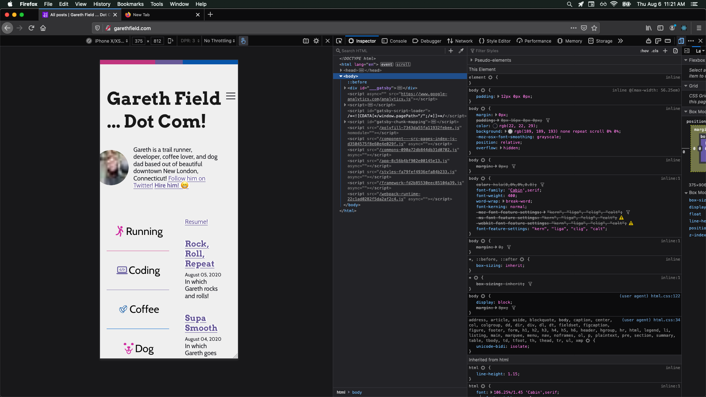
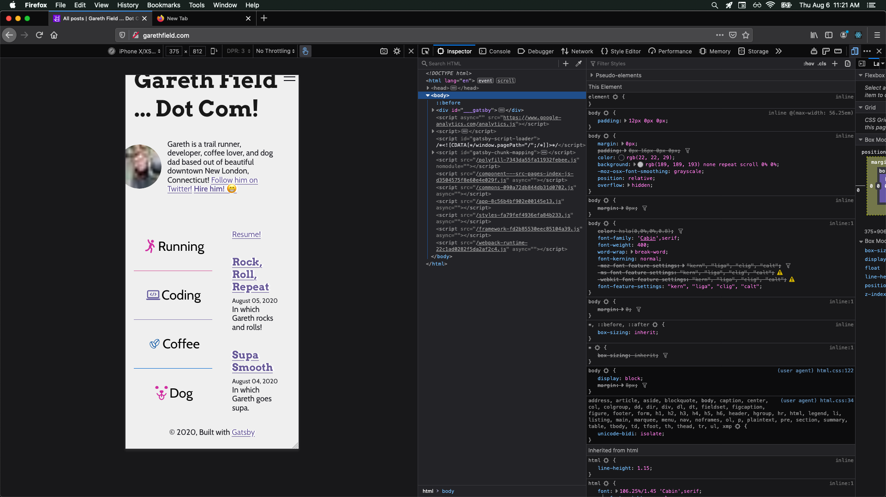
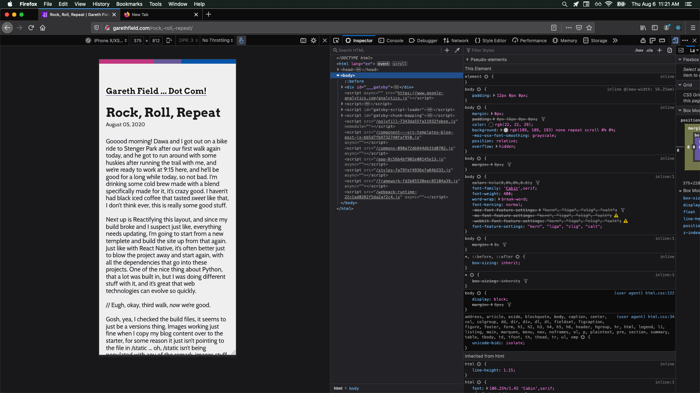
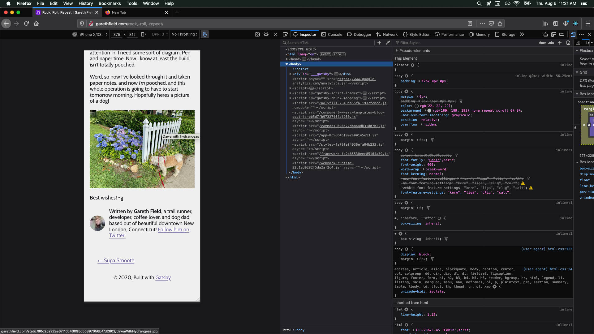

Good morning! Somehow it's still morning! I was up early today, got Dawa out, and then instead of taking him for a bike ride I went for a long run, which my legs were kinda not ready for, but I started back up after a walking break and made it home, then worked in the park a little with Dawa hanging out with his buds, he was pretty chill, I took him for an afternoon run yesterday on top of his usual morning run, which included socialization and sprints yesterday. I thought about what I needed to do with the code on the run today, now I just need to bust this out. Pen and paper time, though, I was looking at it at the park and I think I know the todo list I need to make, but concentrating there was less than ideal, due to nearby construction and being right on the, albeit relatively quiet, road, so now I'm back inside and Past-Me left Future-Me (and Dawa) air conditioning, thanks Past-Me!

Now on with the show!

Here's how it looks at the moment:

Oh, sweet, dude, I didn't even notice that I broke the whole little tabs thing I had going on there. Yyyea, site overhaul long overdue. Mobile was never really even accounted for except for what came with `gatsby-starter-blog` ... let's wrangle this spaghetti monster in.

Bio takes in location, then if it's root it returns a fragment with either a wrapper with an Image and a p tag with a links saying follow me on Twitter or hire me, lol, or a ... slightly differently styled wrapper with an Image and a p tag with a link saying follow me on Twitter. Info about the author and the Twitter account, as well as the source of the Image, come from a useStaticQuery call. Bio is rendered as the first non- react-helmet component inside Layout from index.js, and inside a footer in blog-post.js, right above the navigation. Inside Layout. 🤮

Index takes in location and data from a page query, then it ... oh, how sad is that greyed-out import statement up there, I meant to do something better for mobile, lol. Okay, well, it returns Layout with location and a title that comes from data, then the whole home page, passing the whole data object through to BlogList, in the coding panel. It used to handle state regarding tabs, I don't know what happened.

Moving on to blog-post, which takes in location, data, and pageContext, and returns a Layout with location and title (from data,) Seo with stuff from data, which I realize I hadn't mentioned in the previous paragraphs, but they were there, and an article and nav, populated with data and pageContext, also including Bio in the article, with location.

Now Layout, which imports Global, and takes in location, title, and children, then checks if location is root before defining Header as either a LandingHeadingWrapper with an h1 with the title, and the hamburger, or an h3 with the title, then it returns a fragment with Global, then checks if location is root and either LandingMainDiv or OtherMainDiv with the same contents, a header tag with Header, a main tag with children, and a footer.

... so what we _need_ is ...

Okay Bio dismantled, for starters, just need to not lose the ... the location part only gets used one, but the graphql query needs to be in index and blog-post, the Twitter thing will be handled elsewhere, and soak up the looking for work part in a GitHub issue.

Index then needs to take that graphql query in, and then make a media query, and then, to layout, pass either one set or another of things already spelled out in ./index.html. Also, all of the markup that makes up the homepage should live here, not in Layout.

Blog-post should have Bio taken out, and the graphql will have to be added to the useStaticQuery, and also should make a media query. I think? It looks like the Typography module is making it's own media query, though it isn't doing much with it. Should either review its scale and rhythm functions or switch to something else.

The last Syntax FM with lobotomized owl CSS, that one might be good to listen to for the next revamp.

Okay so then _Layout_ needs to make it's location check if it's root or not and then we need to add a media query, because at least with the homepage, we're going to be rendering different content that needs to be wrapped accordingly. Layout can contain the wrapper components, as well as global, but the homepage's components should be moved to index.js.
