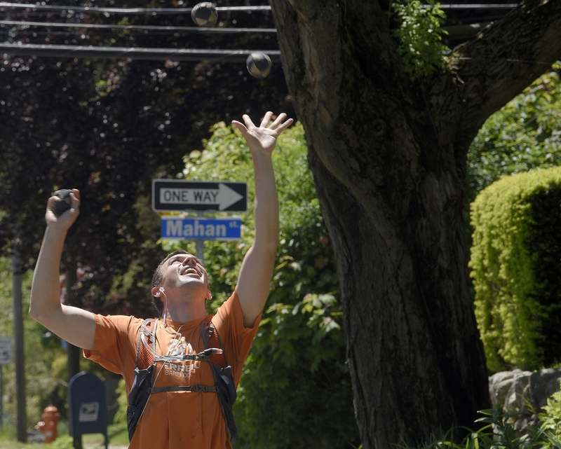

Okay, that's it. Done. Not doing that again. Eugh.

I've got to make some changes in my life, and I've got to see a doctor, lol.

So overwhelmed right now ... yea, doesn't seem like any coding is going to get done today. I'm a mess.

However! I _was_ mentioned in episode 348: Getting Unstuck of the Design Details podcast (!) and was **wildly** misquoted in New London's newspaper The Day:

> "I don't like running or biking; this is my thing, I like juggling," he said.

At least this photo was okay:



///

Alrighty, so it's evening, I've relaxed somewhat, still going to be a stressfull week, mais c'est la vie, let's check **this** out though! `gatsby-remark-vscode` is a plugin that ... well, _should_ soak up my vscode theme so that code looks like ...

```js
import { css } from "styled-components";

const size = {
  small: 400,
  med: 960,
  large: 1140,
};

export const above = Object.keys(size).reduce((acc, label) => {
  acc[label] = (...args) => css`
    @media (min-width: ${size[label] / 16}em) {
      ${css(...args)}
    }
  `;
  return acc;
}, {});

export const below = Object.keys(size).reduce((acc, label) => {
  acc[label] = (...args) => css`
    @media (max-width: ${size[label] / 16}em) {
      ${css(...args)}
    }
  `;
  return acc;
}, {});
```

OH, SWEET, DUDE! Needed _something_ to go well today, lol.
