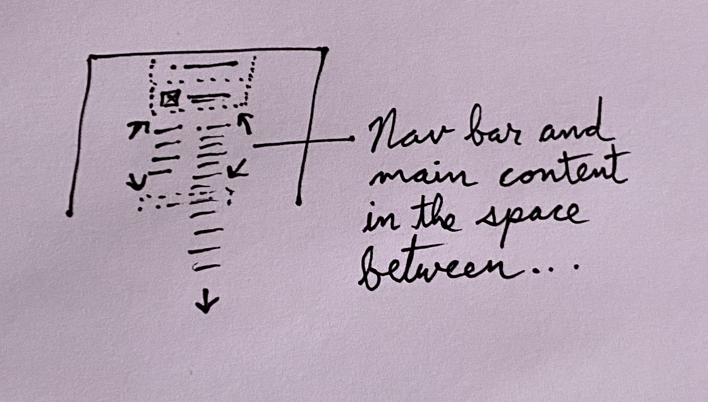
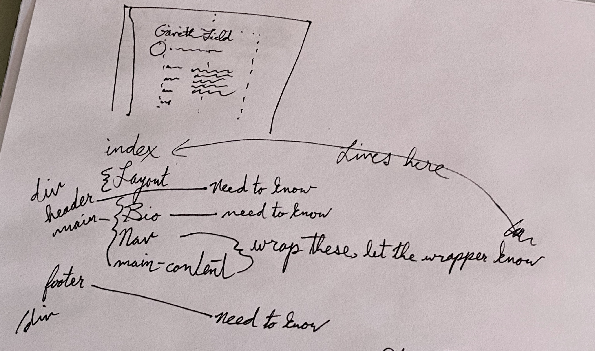
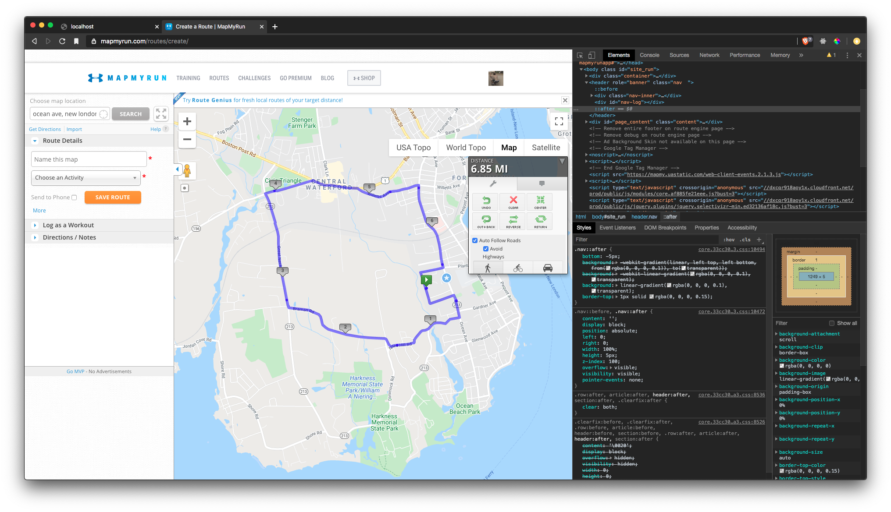

> The space between ... the tears we cry is the laughter keeps us coming back for more ... the space between ... -- Dave Matthews Band, "The Space Between"

## The Problem

So I've got an idea for a layout for my landing page, seems pretty simple, there's already a header, then a 'bio' component, and a footer, and I want to have a nav bar that works like tabs and a space for the main content fill up the remaining space, with the whole thing taking up 100% of the vertical space of the screen, so like only that main content part being able to scroll, at least on desktop and tablet.

So what's the big deal? Height of the screen is easy, `100vh`, then just subtract the height of the header, bio component, footer, account for any padding, bada-bing, bada-boom.

Not so fast, cowboy! Maybe there _is_ a simple solution and my CSS skills just aren't what they need to be, but googling it pulls up a lot of results for when the heights of the other elements are known or can be easily calculated, and if I'd rolled all of this myself, I'd be able to add it up simply, even accounting for changing heights based on font sizes with the `rem` unit, but I used `gatsby-starter-blog`, which has been great, but like the first h1 tag has `font: 106.25%/1.45` and `line-height: 1.15` and ... wait ...

## The Solution

Well, the solution ends up being, I think, that I'm an idiot and didn't see that literally every bit of height, margin, and padding in this whole arrangement _is_ based on the `rem` unit, and like three minutes of trial and error is going to get me were I need to be. I was about to do this whole thing with `react-sizeme`, which is a library that gives you something like element queries, which isn't a thing yet, but because the index page renders the layout component that takes in children as a prop, and only part of that needed to be sized, based on its siblings, but also based on the other components in 'layout', it was going to be this whole thing.

> "You're the dumbest smart person I know." -- Dave Crump

Yyyeap, 14.2 was the magic number. Why not 17.825 or 20.65343? Great question. There's 3.625rem missing in my calculations somewhere, but now we have new challenges! Yay! Oh, actually, there's a whole _other_ 3.625rem missing, too. What in the what. Oh wait, no, subtraction, I found the initial 3.625rem, lol.

## Moving On

Hmm, so there are solutions for having the scrollbar always be visible with the ::-webkit-scrollbar:vertical pseudoelement and pseudoclass ... [Steven Lewis' CodePen on it](https://codepen.io/stevenlewis/pen/hubpL) ... which we're going to leave for now, and revisit when I have more content.

Okay, wow, coming along! Wonder how it looks on mobile, lol. Oh, jeez. So the header wraps a line and blows away the math I did, and the -px to the left that I used to create the two key lines sends it right off the screen, but one thing at a time here.

Oooh, todo: credit [Chris Coyier's article](https://css-tricks.com/overriding-default-button-styles/) for the button reset. Oh, I'm doing tabs stupidly, though. I feel like I'm more in CSS mode, so let me get the styling a little better, then I'll take Dawa for another walk and come back to JS-land.

Oof, needs a bit more work, wow though. Can't sit anymore though :) //

Boyo, we got a _long_ one in! I mean, we've had longer ones, even recently, but considering being sick, that was ... how far was that? I use [mapmyrun.com](mapmyrun.com) for this type of thing ...

Okay, made some slight changes, going to just fix up the buttons and I'm going to look for jobs to apply to! It's go time!

Oh no ... the itis! I knew I shouldn't have had that last spoonful of beans, but it was sooo gooood! Alright, I need to return to this with a fresh mind. ///..
